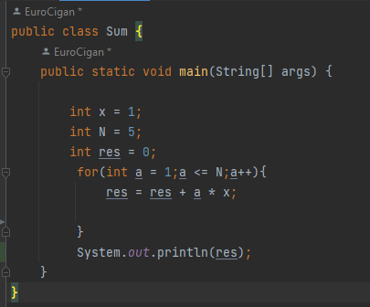
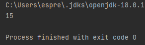

 # Math Functions Annotation

 ## Factorial 
  __Factorial__ -  добуток натуральних чисел від одиниці до n включно, позначається n!.
  В даній функції ми оголошуємо три змінні [int f = 6],[int n = 6].
  Після чого ви викликаємо цикл __for__ в якому оголошуємо [int i = 1] та задаємо умови
  циклу такі як [i < n] та [i++]. Після чого за допомогою рівняння [f = f * i] ми 
  вирішуємо задачу і отримуємо результат.

 ## Power Of The Number
 __Power of the Number__ - математичний термін, що означає результат дії піднесення до
 степеня. В даній функції ми призводим вказане число до вказаного степеню.
 Для початку ініціалізуюмо 3 змінні [int c = 5],[int res = 1] та [int s = 3].
 Після оголошення змінних починається цикл __For__ в якому ми оголошуємо змінну 
 [int i = 0] та задаємо умови роботи циклу [i < s] та [i++].
За допомогою виразу [res = res * с] ми отримуємо рішення нашого циклу а отже і задачі.

 ## Double Factorial
 __Double Factorial__ - це функція яка перемножує між собою лише парні або лише непарні 
 числа з будь якої вибірки. Наприклад [!!7 = 1 * 3 * 5 * 7]. Спочатку для виконання 
 завдання ми оголосимо 2 змінні і зробимо перевірку для того щоб розуміти який у нас 
 факторіал парний чи не парний за допомогою __if__ та __else__. Після чого ми викликаємо
 цикл __For__ в якому ініціалізуємо [int i = 1], та умови роботи циклу [i <= num] та 
 [i++]. Після чого ми викликаємо __if__ в якому прописуємо рівняння яке буде умовою 
 правильності виконання циклу.

 ## Sum
 __Sum__ - це додавання одного числа до іншого. В данному завданні мені потрібно було
 додати між собою усі цифри від [int х = 1] до [int N = 5] включно. Додатково ми 
 вводимо змінну [int res = 0]. Для цього ми викликаємо __For__ в якому ініціалізуємо
 [int а = 1], та умови роботи циклу[a <= N] та [a++]. Після чого ми пишемо рівняння в
 якому буде все це робитись [res = res + a * x].

